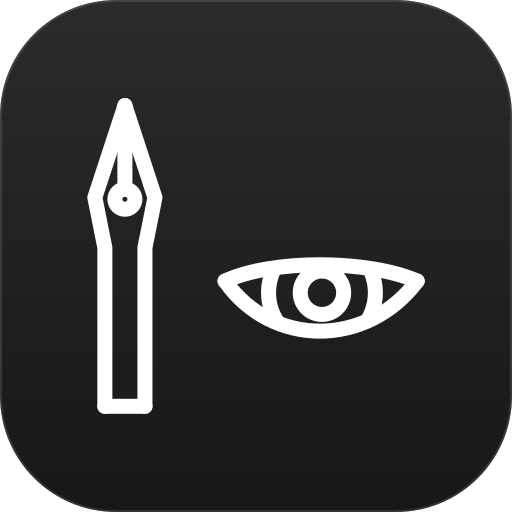

<div align="center">
  
</div>

<h1 align="center">inward-note-vault</h1>

<p align="center">
  <a href="CHANGELOG.md"></a>
  <a href="LICENSE"></a>
  
  
  <a href="https://github.com/AlexTrinityBlock/inward-note-vault/pulls"></a>
</p>

<p align="center">
  
  
  
  
  
  
</p>

A self-hosted notebook you can run with one command. Notes live in SQLite; the
ones you mark as encrypted are sealed in your browser, so the server only ever
stores ciphertext. A one-click action asks Jev (TypeSafe System One) where a note
belongs — the classification is optional, and encrypted notes ask for consent
first, because that is the one moment their text leaves your browser.

> Status: v0.3.0 — the app is complete end to end: accounts, both notebooks,
> folders, categories, classification, three UI languages, on a three-tier
> interface with real routes.

## Highlights

- **Runs anywhere.** One `uv run` on a machine with Python, or `docker compose up`.
  No database server, no build step for the client in the container image.
- **Two notebooks.** Plain notes are stored as text and searchable. Encrypted
  notes are encrypted in the browser with a password the server never sees.
- **Three tiers, real routes.** Pick a notebook at `/`, browse it at
  `/n/:notebook`, open a single note at `/n/:notebook/notes/:noteId`. Every
  screen is a URL you can link to, and the back button works.
- **Editor + preview.** A note opens rendered; entering edit mode splits the page
  into Markdown on the left and the preview on the right.
- **Folders and categories.** A `parent_id` folder tree and categories shared by
  both notebooks.
- **Jev classification.** One request returns a folder choice plus a probability
  for each candidate category; you accept, adjust or ignore it.
- **三種語言.** English, 繁體中文 and 简体中文.

## Quick start

### Docker

```bash
docker compose up --build
# open http://127.0.0.1:8000
```

The SQLite file lives on the `vault-data` volume, so it survives rebuilds.
Development servers with hot reload are in `docker-compose.dev.yml`.

### Bare metal (uv)

`uv` is the only thing you need to install. The built client is committed, so
there is no Node toolchain and no build step:

```bash
cd backend
uv sync
uv run inward-note-vault          # http://127.0.0.1:8000
```

The first visit leads through setup: create the account, and optionally paste a
TypeSafe API key. The database file is created at `backend/data/vault.db` and
migrations run at start-up.

Bun is needed only if you are changing the frontend — rebuild
`frontend/dist` and commit it, because that is what gets served:

```bash
cd frontend
bun install && bun run build
```

### Launchers

The bare-metal steps above are wrapped in one script per platform. Each checks
for `uv` and for the committed client, syncs the backend, and serves — passing
arguments through, so `--port` and `--reload` still work.

| Platform | Run |
| --- | --- |
| Windows (PowerShell) | `./start.ps1` |
| Windows (double-click or cmd) | `start.bat` |
| macOS / Linux | `./start.sh` |

```bash
./start.ps1 --port 9000        # or: ./start.sh --port 9000 --reload
```

They do not install `uv`; if it is missing they say so and exit.

## How the two notebooks differ

| | Plain | Encrypted |
| --- | --- | --- |
| Where the text lives | SQLite, readable | Ciphertext only |
| Keys | — | PBKDF2-SHA256 (600k) → AES-GCM, derived in the browser |
| Server-side search | Yes — title and body | No — the server holds ciphertext, so the browser searches the notes it has decrypted |
| Jev classification | Direct | Only after you confirm Jev will see the content |
| Recovery | — | None. Forget the notebook password and the notes are gone |

Not encrypted either way: note ids, timestamps, folder membership and category
names. The server needs those to build the tree, the filters and the search. The
password and the derived key never leave the browser; the server stores only the
KDF salt, the iteration count and a verifier blob. The TypeSafe API key is stored
in SQLite and never returned by the API.

## Pages

The notebook side of the app is three tiers on four routes, plus settings:

| Route | Screen | What it is |
| --- | --- | --- |
| `/` | `PortalRoute` | Choose a notebook: Plain, or Encryption — which asks for its password before anything loads. |
| `/n/:notebook` | `DriveRoute` | The Drive-style browser: folder cards, note cards or a sortable table, the sidebar directory, breadcrumbs, search and a grid/list toggle. |
| `/n/:notebook/categories` | `CategoryRoute` | Category management: a card grid with note counts, add, rename, delete, and a drill-down into the notes carrying one. |
| `/n/:notebook/notes/:noteId` | `NoteRoute` | One note on a full-width page, in read or write mode. |
| `/settings` | `SettingsRoute` | The TypeSafe key, auto-classification and how the encryption works. |

`notebook` is `plain` or `encrypted`; anything else redirects to `/`. The old
`/?notebook=encrypted` link still lands on `/n/encrypted`. What the drive is
looking at — folder, category, search text, sort and view mode — lives in the
query string on `/n/:notebook` rather than in component state, so a refresh lands
where the reader was and the back button walks back through what they opened. The
encrypted notebook's key is held by `EncryptedNotebookProvider` on the
`/n/:notebook` layout, so it survives moving between the drive, a category and a
note; it is still memory-only, and a reload locks the notebook again.

## Layout

```
├── backend/            # FastAPI + SQLAlchemy + Alembic, SQLite storage
├── frontend/           # React + TypeScript, Vite, Orval-generated client
│   └── dist/           # the built client, committed so only `uv` is needed
├── image/              # the app icon, and the tile the README header shows
├── .dsh/skills/        # project skills, including TypeSafe judgment guidance
├── start.ps1           # one-step launcher (also start.sh, start.bat)
├── docker-compose.yml  # single container, SQLite on a volume
├── Dockerfile          # serves the committed client from the API, no Node stage
└── private-docs/       # local notes, never committed
```

Each side has its own README with the details:
[backend](backend/README.md) · [frontend](frontend/README.md).

## Configuration

| Variable | Default | Purpose |
| --- | --- | --- |
| `INWARD_DATA_DIR` | `data` | Directory holding `vault.db` |
| `INWARD_DATABASE_URL` / `DATABASE_URL` | SQLite in `INWARD_DATA_DIR` | Override the connection string |
| `INWARD_STATIC_DIR` | `../frontend/dist` | Built client to serve |
| `INWARD_COOKIE_SECURE` | `false` | Set when serving over HTTPS |
| `INWARD_SESSION_TTL_HOURS` | `720` | Session lifetime |
| `TYPESAFE_API_KEY` | — | Fallback when no key is stored in the database |

`.env` in the repository root or in `backend/` is read at start-up.

## Development

```bash
cd backend  && uv run pytest -q && uv run ruff check .          # 56 tests
cd frontend && bun test && bun run typecheck && bun run build   # 57 tests

# after changing the frontend, rebuild the bundle that ships with the repo
cd frontend && bun run build

# regenerate the typed API client after changing the API
cd frontend && bun run api:generate
```

`api:generate` runs `frontend/scripts/generate-client.mjs`, which calls Orval's
programmatic `generate()` instead of the Orval CLI: the CLI loads
`orval.config.ts` through `jiti`, which spawns a child process. The script carries
its own copy of the project options, so change the two together.

## Versioning

Development happens on `develop`; `master` tracks released history. Releases are
tagged `vX.Y.Z` — see [CHANGELOG.md](CHANGELOG.md).

## License

MIT — see [LICENSE](LICENSE).
